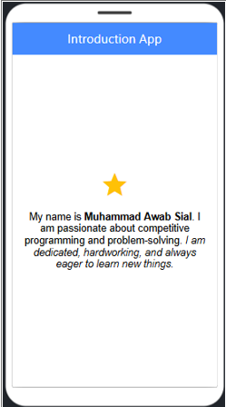

# Introduction App - Lab 3


## 📌 Overview
This is a simple **Introduction App** developed as part of the **Mobile Application Development (MAD) Lab 3** at Bahria University. The application demonstrates basic Flutter UI components such as **AppBar, Text, and Styling**.

## 📁 Project Structure
```
Lab_3/
│── lab_3.dart      # Flutter app source code
│── Lab Journal 3.docx  # Lab report documentation
│── ss_1.png       # Screenshot of the application
│── README.md       # Project documentation
```

## ✨ Features
- Uses **AppBar** with a custom title.
- Displays **text with different styles and formatting**.
- Implements **background color customization**.
- Enhances UI using **TextSpan for styled text**.

## 🚀 Getting Started
### Prerequisites
Ensure you have the following installed:
- [Flutter SDK](https://flutter.dev/docs/get-started/install)
- Dart (comes with Flutter)
- Code editor (VS Code or Android Studio recommended)

### Installation
1. Clone the repository:
   ```sh
   git clone https://github.com/yourusername/Lab_3.git
   cd Lab_3
   ```
2. Run the app:
   ```sh
   flutter run
   ```

## 📸 Screenshots
Here is a preview of the application:



## 📜 License
This project is for educational purposes.

## 🙌 Acknowledgments
- **Instructor:** Sir Mohsin Javed Butt
- **University:** Bahria University E8, Islamabad
- **Student:** Muhammad Awab Sial
- **Enrollment No:** 01-134222-091
- **Class:** BS-CS 6-B

---
💡 *Happy Coding! 🎉*

